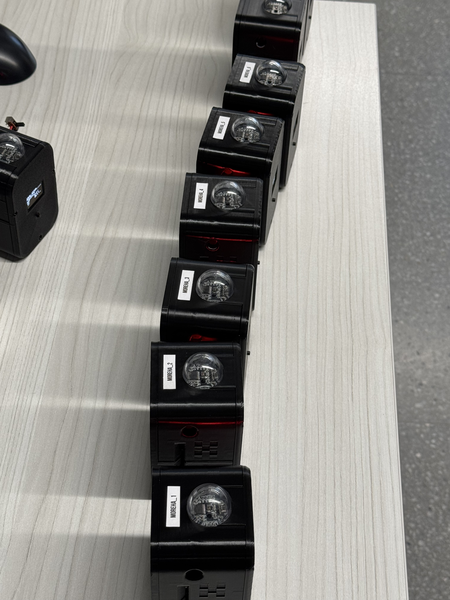
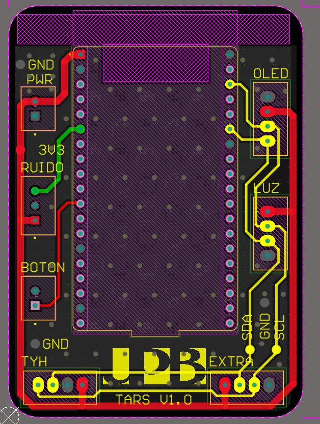
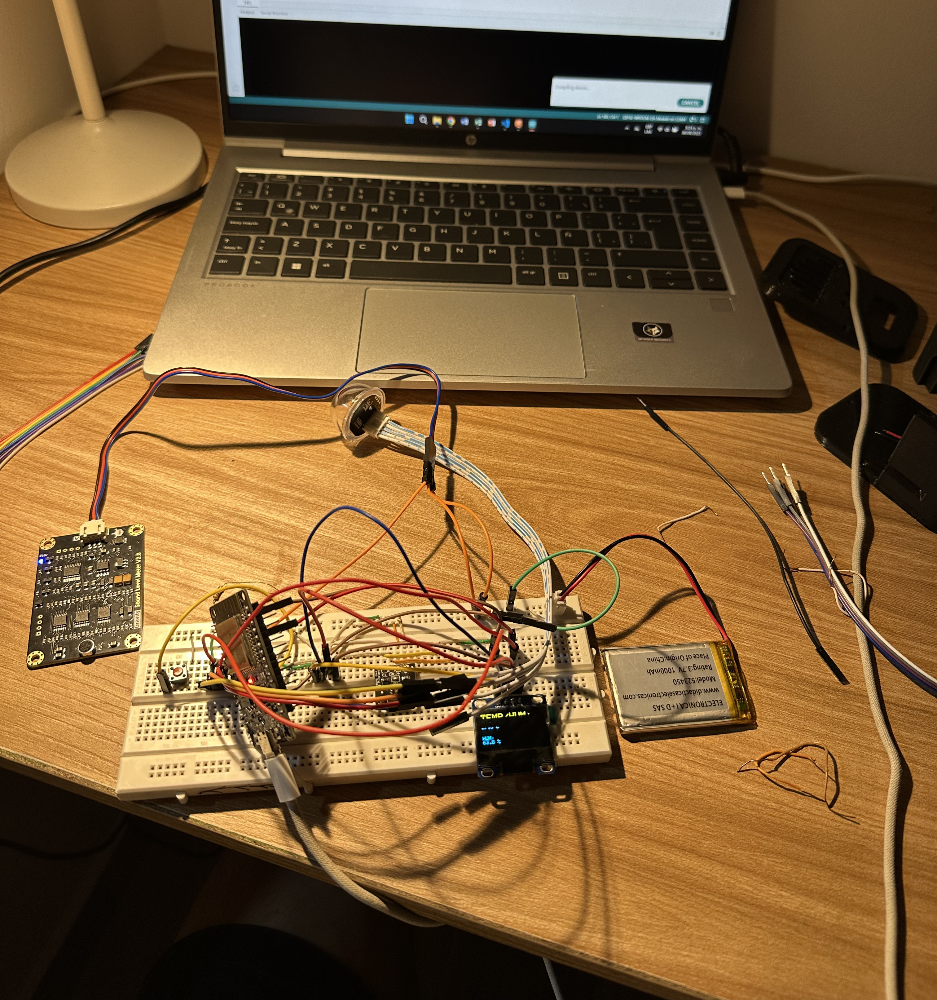
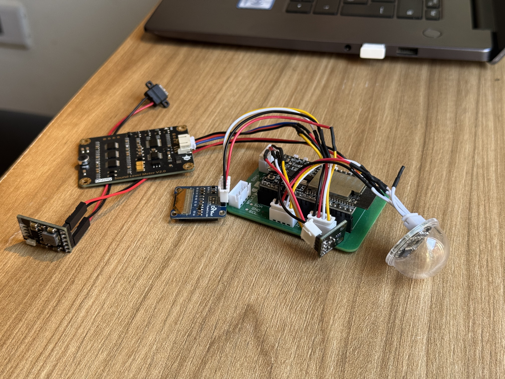
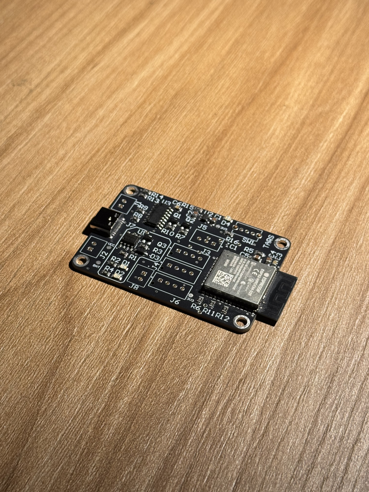

# TARS — Sistema Modular de Monitoreo Ambiental Portátil basado en ESP32

Dispositivo modular de monitoreo ambiental para interiores, basado en ESP32, con pantalla OLED, navegación por botón físico y firmware gobernado por una máquina de estados. Envía sus datos periódicamente a la plataforma en la nube MOREHA, construida sobre el estándar FIWARE. Desarrollado en el Semillero AgeVital, Universidad Pontificia Bolivariana.




## Descripción

TARS mide temperatura, humedad, luminosidad y ruido, y muestra los datos en tiempo real en una pantalla OLED con navegación por botón. El firmware usa una arquitectura de máquina de estados modular, y los datos se transmiten de forma segura hacia `moreha.com.co` mediante autenticación OAuth2 y paso por PEP Proxy, siguiendo el flujo de FIWARE (Keyrock → Wilma → Orion Context Broker).

## Características

- 🌡️ Temperatura y humedad (HDC1080, I2C)
- 💡 Luminosidad calibrada (DFRobot B-LUX-V30B, con filtro de mediana + descarte de picos)
- 🔊 Nivel de ruido (sensor analógico calibrado)
- 🧪 *(Experimental)* Calidad de aire — PM1.0 / PM2.5 / PM10 (DFRobot SEN0460), en evaluación energética y de laboratorio
- 🔌 Modularidad y expansión I2C: espacio físico y líneas disponibles en la placa para incorporar nuevos sensores I2C
- 🖥️ Pantalla OLED con navegación multi-pantalla por botón físico (pulsación corta/larga)
- 📡 Conectividad IoT industrial: envío periódico con autenticación OAuth2 y PEP Proxy

### Expansión I2C

La placa reserva espacio físico y líneas de conexión libres para incorporar fácilmente un sensor adicional, siempre que use el protocolo I2C.



### Sensor de calidad de aire (experimental)

Integración en curso del sensor PM1.0 / PM2.5 / PM10 (DFRobot SEN0460), actualmente en fase de evaluación energética y de laboratorio.


## Arquitectura del firmware

```
StateMachine
├── EstadoINICIO        → conexión WiFi, primer boot
├── EstadoLECTURA        → lectura periódica de sensores + refresco de pantalla
├── EstadoENVIO           → autenticación OAuth2 + PATCH a Orion vía Wilma
└── EstadoDESARROLLADOR  → modo de diagnóstico y configuración
```

El procesamiento local de sensores incluye filtros digitales — filtro de mediana y descarte de picos extremos — aplicados especialmente al sensor de luz, para evitar transiciones erróneas causadas por lecturas espurias.

## Estructura del repositorio

```
TARS/
├── firmware/
│   └── TARS/              → sketch principal (Arduino/ESP32)
├── hardware/                → esquemáticos y diseño de PCB
├── docs/                    → capturas, fotos, diagramas
├── README.md
└── LICENSE
```

## Hardware

| Componente | Función | Conexión |
|---|---|---|
| ESP32 DevKit | Controlador principal | — |
| HDC1080 | Temperatura y humedad | I2C |
| DFRobot B-LUX-V30B | Luminosidad | I2C |
| DFRobot SEN0460 *(experimental)* | Calidad de aire (PM1.0/2.5/10) | I2C |
| Sensor de sonido (analógico) | Nivel de ruido | ADC |
| OLED SSD1306 | Interfaz visual | I2C |
| Botón pulsador | Navegación de pantallas | GPIO digital |
| Batería LiPo 1000 mAh + módulo UPS-LIPO-2 | Alimentación y carga | — |

## Evolución del hardware

TARS ha pasado por tres etapas de maduración, desde un prototipo de pruebas hasta una placa totalmente integrada.

<table>
<tr>
<td><br/><sub>Fase 1 — Prototipo inicial (breadboard), evaluado en Ecovilla UPB</sub></td>
<td><br/><sub>Fase 2 — PCB v1.5 (actual), shield para ESP32 DevKit</sub></td>
</tr>
</table>


<p><sub>Fase 3 — Nueva PCB integrada: ESP32 soldado, UPS embebido y USB-C nativo, sin necesidad de placas adicionales</sub></p>

| Fase | Formato | Alimentación | Integración |
|---|---|---|---|
| 1. Prototipo | Protoboard | Externa / provisional | Ninguna, cableado expuesto |
| 2. PCB v1.5 (actual) | Shield para ESP32 DevKit | Batería LiPo 1000 mAh + UPS externo (UPS-LIPO-2) | Headers hembra, conectores JST |
| 3. PCB v2 (siguiente gen.) | Placa integrada compacta | UPS embebido + USB-C nativo | ESP32 soldado, todo en una superficie |

## Protocolo de transmisión de datos (MOREHA)

TARS transmite hacia `moreha.com.co` siguiendo el flujo de seguridad de FIWARE, en dos pasos.

**Paso 1 — Autenticación OAuth2 (Keyrock):**

```
POST http://moreha.com.co:7000/oauth2/token
Content-Type: application/x-www-form-urlencoded

grant_type=password
client_id=<CLIENT_ID>
client_secret=<CLIENT_SECRET>
username=<DEVICE_USERNAME>
password=<DEVICE_PASSWORD>
```

La respuesta exitosa devuelve un `access_token` temporal.

**Paso 2 — Transmisión segura (PEP Proxy Wilma → Orion Context Broker):**

```
PATCH http://moreha.com.co:1027/v2/entities/{deviceId}/attrs
Authorization: Bearer <access_token>
Content-Type: application/json

{
  "temperature": { "value": 23.4, "type": "Number" },
  "humidity": { "value": 55.2, "type": "Number" },
  "noise": { "value": 41.0, "type": "Number" },
  "luminosity": { "value": 320, "type": "Number" }
}
```

Wilma valida el token con Keyrock y, si es correcto, autoriza el paso hacia Orion Context Broker. QuantumLeap y CrateDB gestionan el histórico, disponible finalmente en Dashboards de Grafana.


## Instalación

1. Instala las librerías necesarias desde el Gestor de Librerías del IDE de Arduino:
   - `Adafruit GFX Library`, `Adafruit SSD1306`
   - `ArduinoJson`
   - `ClosedCube_HDC1080`
   - `DFRobot_B_LUX_V30B`
2. Abre `firmware/TARS/TARS.ino`
3. Selecciona la placa ESP32 en `Herramientas > Placa`
4. Sube el código
5. En el primer arranque, conéctate al portal cautivo local y configura la red WiFi del dispositivo

## Estado del proyecto

El sensor de calidad de aire (PM1.0/2.5/10) está en fase experimental, en pruebas de laboratorio y validación de consumo energético antes de integrarlo al conjunto de sensores oficial. La PCB v1.5 es la placa con la que operan actualmente todos los dispositivos TARS construidos hasta la fecha; la PCB v2 integrada está en desarrollo como siguiente generación.

## Créditos

Desarrollado en el Semillero AgeVital, Universidad Pontificia Bolivariana. Supervisión técnica: Henry Andrade Caicedo. Desarrollo: Fer Castro.

## Licencia

MIT — ver [LICENSE](LICENSE)
