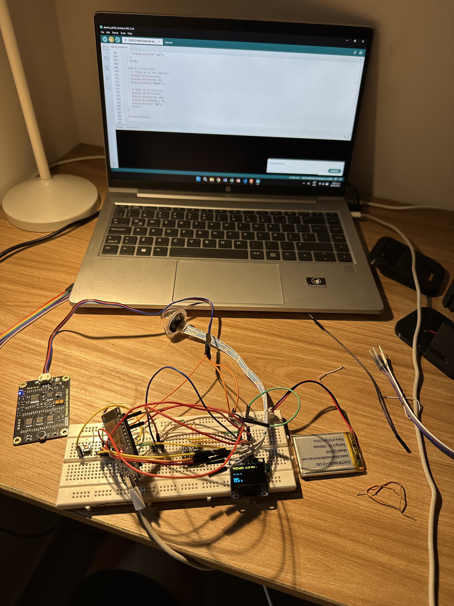
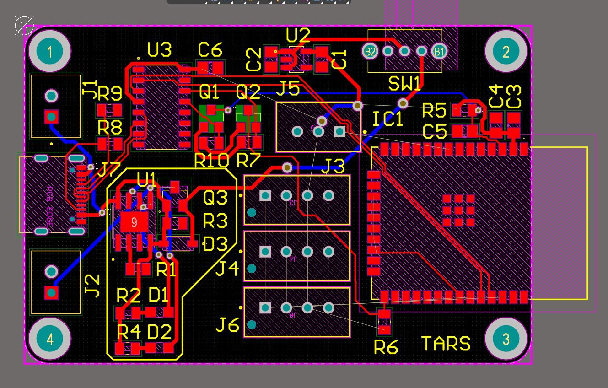
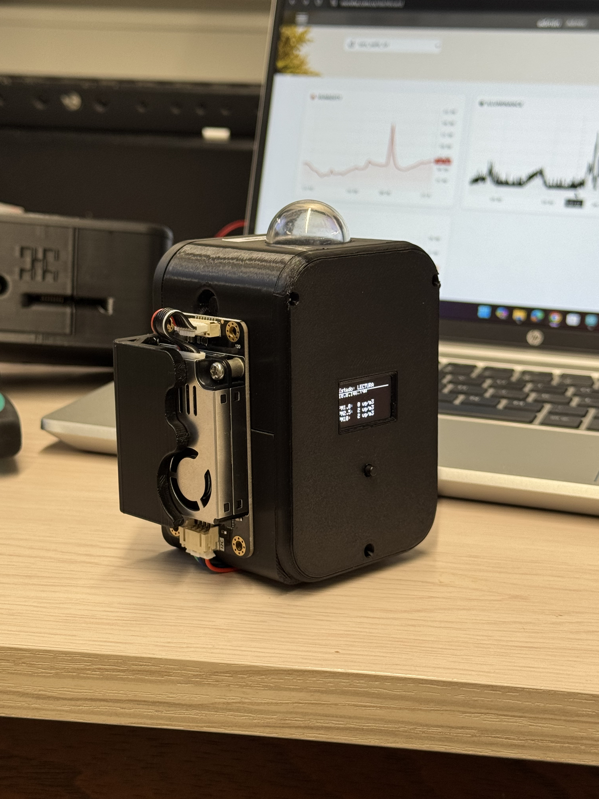

# TARS — Monitor Ambiental Portátil ESP32

Dispositivo compacto de monitoreo ambiental para interiores, basado en ESP32, con pantalla OLED, navegación por botón físico y carga USB-C con gestión de batería (UPS). Desarrollado en el Semillero AgeVital, Universidad Pontificia Bolivariana.


## Descripción

TARS es un dispositivo portátil de escritorio para monitoreo ambiental en interiores: temperatura, humedad, luminosidad y ruido, con una pantalla OLED que muestra los datos en tiempo real y un botón para navegar entre vistas. Se alimenta por USB-C, con un circuito UPS que administra la carga de la batería y entrega los 5V regulados necesarios para el sistema. El firmware usa una arquitectura de máquina de estados modular, y los datos se envían periódicamente a un broker FIWARE Orion Context Broker.

## Características

- 🌡️ Temperatura y humedad (HDC1080, I2C)
- 💡 Luminosidad calibrada (DFRobot B-LUX-V30B, con filtro de mediana + rechazo de picos)
- 🔊 Nivel de ruido (sensor analógico calibrado)
- 🧪 *(Experimental)* Calidad de aire — PM1.0 / PM2.5 / PM10 (DFRobot SEN0460), en evaluación para integración futura
- 🖥️ Pantalla OLED con navegación multi-pantalla por botón físico (pulsación corta/larga)
- 🔋 Carga USB-C con circuito UPS: gestiona batería y entrega 5V regulados al sistema
- 📡 Envío periódico a FIWARE Orion Context Broker con autenticación OAuth2 (Keyrock)
- ⚙️ Modo desarrollador con portal web de configuración OTA (WiFi, intervalos, servidor)
- 🔧 PCB propia (v1.5) con conector USB-C, diseñada en Altium Designer

## Arquitectura del firmware

```
StateMachine
├── EstadoINICIO       → conexión WiFi, primer boot
├── EstadoLECTURA       → lectura periódica de sensores + refresco de pantalla
├── EstadoENVIO         → PATCH a Orion / POST a agente Flask
└── EstadoDESARROLLADOR → portal web de configuración (AP o STA)
```

Cada sensor se lee y valida en `SensorManager`, con filtros de rango específicos por sensor (ej. descarte de lecturas fuera de rango físico en HDC1080, filtro de mediana + salto máximo en el sensor de luz para evitar picos por transición de auto-ganancia). Las lecturas se acumulan para promedio durante el intervalo de envío y se serializan en `PayloadBuilder` siguiendo el modelo de entidades NGSI de FIWARE.

## Estructura del repositorio

```
TARS/
├── firmware/
│   └── TARS/              → sketch principal (Arduino/ESP32)
├── hardware/                → esquemáticos y diseño de PCB (Altium)
├── docs/                    → capturas, fotos, diagramas
├── README.md
└── LICENSE
```

## Hardware

| Componente | Función | Conexión |
|---|---|---|
| ESP32 DevKit | Controlador principal | — |
| HDC1080 | Temperatura y humedad | I2C |
| DFRobot B-LUX-V30B | Luminosidad | I2C |
| Sensor de sonido (analógico) | Nivel de ruido | ADC |
| OLED SSD1306 128x64 | Interfaz visual | I2C |
| Botón pulsador | Navegación de pantallas | GPIO digital |
| Circuito UPS + USB-C | Carga y regulación a 5V | — |

## Evolución del proyecto

TARS partió de un prototipo funcional en breadboard, evaluado en Ecovilla UPB, y evolucionó hacia una PCB propia diseñada en Altium para reducir tamaño y facilitar el uso como dispositivo de escritorio.

<table>
<tr>
<td><br/><sub>Prototipo inicial en breadboard</sub></td>
<td><br/><sub>PCB v1.5 con conector USB-C</sub></td>
</tr>
</table>

### Esquemático



### Interfaz OLED



## Instalación

1. Instala las librerías necesarias desde el Gestor de Librerías del IDE de Arduino:
   - `Adafruit GFX Library`, `Adafruit SSD1306`
   - `ArduinoJson`
   - Librería `ClosedCube_HDC1080`
   - Librería `DFRobot_B_LUX_V30B`
2. Abre `firmware/TARS/TARS.ino`
3. Selecciona la placa ESP32 en `Herramientas > Placa`
4. Sube el código
5. En el primer arranque, conéctate al AP generado y configura tu red WiFi desde el portal de configuración

## Estado del proyecto

El sensor de calidad de aire (PM1.0/2.5/10) está integrado en el firmware pero **aún en fase experimental** — actualmente en pruebas de laboratorio, validando desempeño y consumo energético dentro del presupuesto del UPS antes de integrarlo al conjunto de sensores oficial.

## Créditos

Proyecto desarrollado por [Fer](https://github.com/1cfer) — Semillero AgeVital, Universidad Pontificia Bolivariana. Prototipo original (TARS_V1) supervisado por el tutor Henry Andrade Caicedo, evaluado en Ecovilla UPB.

## Licencia

MIT — ver [LICENSE](LICENSE)