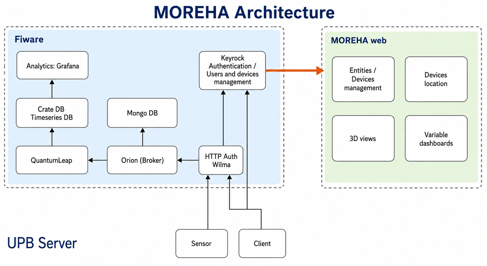
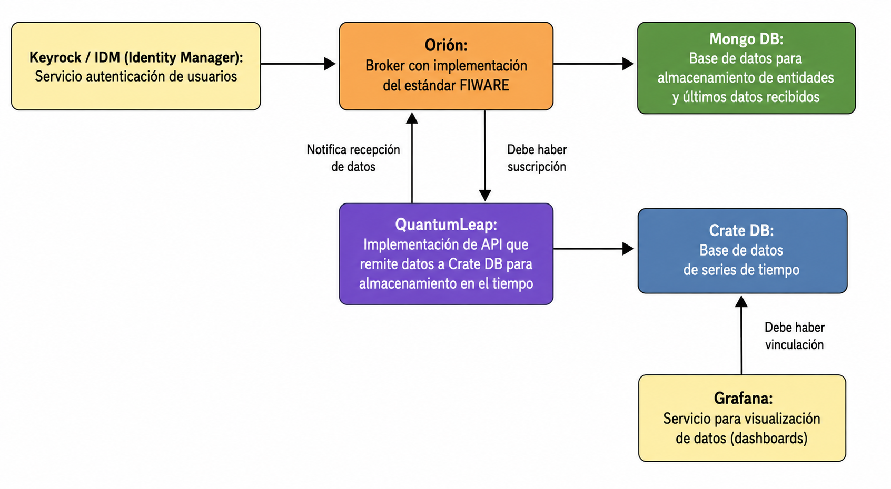
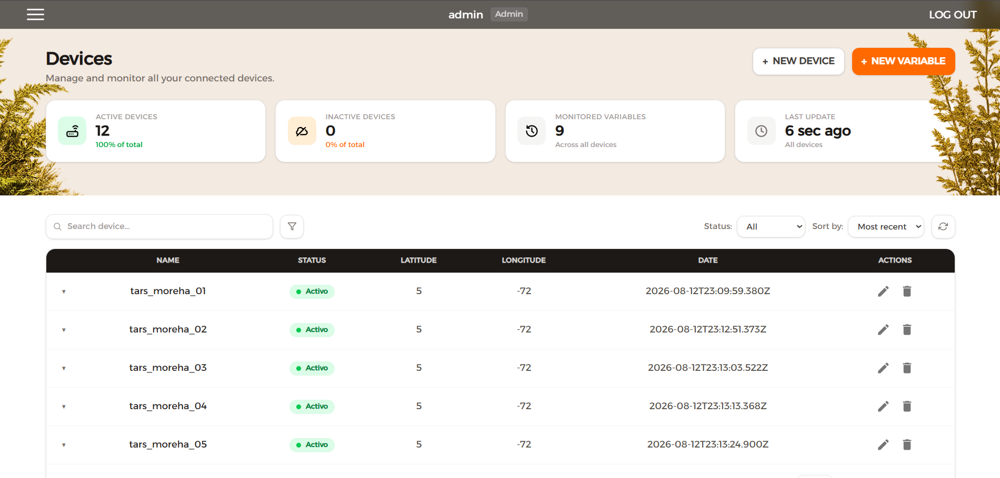
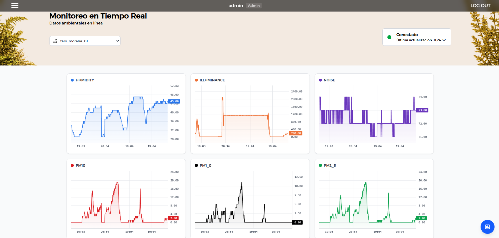

# TARS — Sistema Modular de Monitoreo Ambiental Portátil basado en ESP32

Dispositivo modular de monitoreo ambiental para interiores, basado en ESP32, con pantalla OLED, navegación por botón físico y firmware gobernado por una máquina de estados. Envía sus datos periódicamente a la plataforma en la nube MOREHA, construida sobre el estándar FIWARE. Desarrollado en el Semillero AgeVital, Universidad Pontificia Bolivariana.


## Descripción

TARS mide temperatura, humedad, luminosidad y ruido, y muestra los datos en tiempo real en una pantalla OLED con navegación por botón. El firmware usa una arquitectura de máquina de estados modular, y los datos se transmiten de forma segura hacia `moreha.com.co` mediante autenticación OAuth2 y paso por PEP Proxy, siguiendo el flujo de FIWARE (Keyrock → Wilma → Orion Context Broker).

## Características técnicas

- 🌡️ Temperatura y humedad (HDC1080, I2C)
- 💡 Luminosidad calibrada (DFRobot B-LUX-V30B, con filtro de mediana + descarte de picos)
- 🔊 Nivel de ruido (sensor analógico calibrado)
- 🧪 *(Experimental)* Calidad de aire — PM1.0 / PM2.5 / PM10 (DFRobot SEN0460), en evaluación energética y de laboratorio
- 🔌 Modularidad y expansión por bus I2C: espacio físico y líneas disponibles en la placa para incorporar nuevos sensores
- 🖥️ Pantalla OLED con navegación multi-pantalla por botón físico (pulsación corta/larga)
- 📡 Conectividad IoT industrial: envío periódico con autenticación OAuth2 y PEP Proxy

### Expansión por bus I2C

La placa reserva espacio físico y líneas de conexión libres para incorporar fácilmente un sensor adicional, siempre que use el protocolo I2C.


### Sensor de calidad de aire (experimental)

Integración en curso del sensor PM1.0 / PM2.5 / PM10 (DFRobot SEN0460), actualmente en fase de evaluación energética y de laboratorio.


## Evolución del hardware

TARS ha pasado por tres etapas de maduración, desde un prototipo de pruebas hasta una placa totalmente integrada.

<table>
<tr>
<td align="center"><br/><sub><strong>Fase 1</strong> — Prototipo inicial en breadboard, cableado suelto, evaluado en Ecovilla UPB</sub></td>
<td align="center"><br/><sub><strong>Fase 2</strong> — PCB actual (v1.5), ESP32 sobre headers</sub></td>
</tr>
</table>

<p align="center">
  
  <br/>
  <sub><strong>Fase 3</strong> — Nueva PCB integrada: ESP32, USB-C y UPS nativos en una sola placa</sub>
</p>

| Fase | Formato | Alimentación | Integración |
|---|---|---|---|
| 1. Prototipo | Protoboard | Externa / provisional | Ninguna, cableado expuesto |
| 2. PCB v1.5 (actual) | Módulo ESP32 sobre headers | Batería LiPo 1000 mAh + UPS externa (UPS-LIPO-2) | Headers hembra, conectores JST |
| 3. PCB v2 (siguiente gen.) | Placa integrada compacta | UPS embebida + USB-C nativo | ESP32 soldado, todo en una superficie |

La **PCB v1.5** es la placa con la que operan actualmente todos los dispositivos TARS construidos hasta la fecha: monta la ESP32 como módulo sobre headers hembra, enlaza los sensores mediante conectores JST, y se alimenta con una batería de polímero de litio de 1000 mAh gestionada por una UPS externa (UPS-LIPO-2).

## Arquitectura de firmware

El firmware corre sobre una **máquina de estados modular**:

```
StateMachine
├── EstadoINICIO        → conexión WiFi, primer boot
├── EstadoLECTURA        → lectura periódica de sensores + refresco de pantalla
├── EstadoENVIO           → autenticación OAuth2 + PATCH a Orion vía Wilma
└── EstadoDESARROLLADOR  → modo de diagnóstico y configuración
```

El procesamiento local de sensores incluye filtros digitales — **filtro de mediana** y **descarte de picos extremos** — aplicados especialmente al sensor de luminosidad, para evitar transiciones erróneas en pantalla causadas por lecturas espurias.

## Integración y protocolo FIWARE (MOREHA)

TARS transmite hacia `moreha.com.co` siguiendo el flujo de seguridad de FIWARE, en dos pasos.

**Paso 1 — Autenticación OAuth2 (Keyrock):**

```
POST http://moreha.com.co:7000/oauth2/token
Content-Type: application/x-www-form-urlencoded

grant_type=password
client_id=<CLIENT_ID>
client_secret=<CLIENT_SECRET>
username=<DEVICE_USERNAME>
password=<DEVICE_PASSWORD>
```

El dispositivo no envía datos directamente: primero solicita un `access_token` temporal al Identity Manager (Keyrock) usando sus credenciales.

**Paso 2 — Transmisión segura (PEP Proxy Wilma → Orion Context Broker):**

```
PATCH http://moreha.com.co:1027/v2/entities/{deviceId}/attrs
Authorization: Bearer <access_token>
Content-Type: application/json

{
  "temperature": { "value": 23.4, "type": "Number" },
  "humidity": { "value": 55.2, "type": "Number" },
  "noise": { "value": 41.0, "type": "Number" },
  "luminosity": { "value": 320, "type": "Number" }
}
```

Con el token obtenido, TARS envía el payload al proxy de seguridad **Wilma**, incluyendo la cabecera `Authorization: Bearer <token>`. Wilma valida el token contra Keyrock y, si es correcto, autoriza el paso hacia el **Orion Context Broker**, donde **QuantumLeap** y **CrateDB** gestionan el histórico de datos.

<p align="center">
  
</p>

<p align="center">
  
</p>

## Plataforma web (visualización)

La plataforma **MOREHA** ([moreha.com.co](http://moreha.com.co)) ofrece gestión centralizada de dispositivos e históricos de las variables medidas.

<table>
<tr>
<td align="center"><br/><sub>Gestión de dispositivos — <code>tars1</code> reportando humedad, temperatura, iluminancia, ruido y calidad del aire</sub></td>
<td align="center"><br/><sub>Histórico de humedad y temperatura en el dashboard</sub></td>
</tr>
</table>

## Guía de instalación y requisitos

### Librerías de Arduino necesarias

| Librería | Uso |
|---|---|
| `Adafruit GFX Library` | Renderizado gráfico base para la pantalla OLED |
| `Adafruit SSD1306` | Controlador del display OLED |
| `ArduinoJson` | Serialización/deserialización de payloads JSON |
| `ClosedCube_HDC1080` | Lectura del sensor de temperatura y humedad |
| `DFRobot_B_LUX_V30B` | Lectura del sensor de luminosidad |

### Pasos de configuración

1. Instala las librerías anteriores desde el Gestor de Librerías del IDE de Arduino.
2. Abre el sketch del firmware y selecciona la placa **ESP32** en `Herramientas > Placa`.
3. Carga el firmware al dispositivo.
4. En el primer arranque, conéctate al **portal cautivo local** que expone el dispositivo y configura ahí la red WiFi.
5. TARS reinicia automáticamente y comienza su ciclo normal (`EstadoINICIO` → `EstadoLECTURA` → `EstadoENVIO`).

## Créditos

Desarrollado en el **Semillero AgeVital**, Universidad Pontificia Bolivariana.

- **Supervisión técnica:** Henry Andrade Caicedo
- **Desarrollo:** Fer Castro

## Licencia

MIT — ver [LICENSE](LICENSE)
